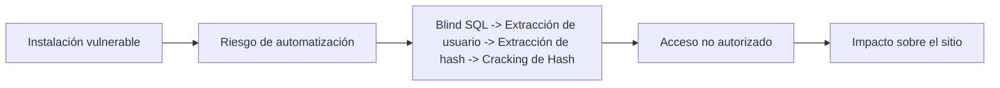
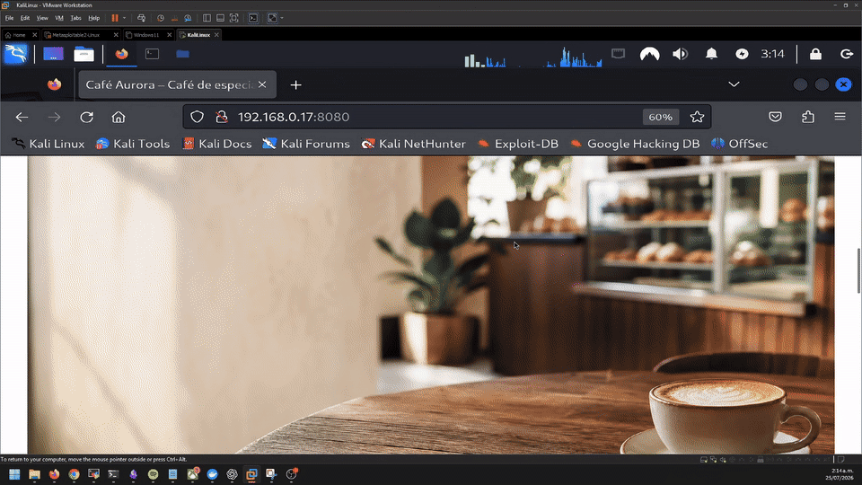

# WP2Shell Checker

WP2Shell Checker es un script de lectura que identifica la versión de WordPress publicada por un sitio y la contrasta con los rangos afectados por CVE-2026-60137 y CVE-2026-63030. El resultado indica si la versión expuesta parece potencialmente afectada, no afectada o si no puede determinarse.

## Sobre las vulnerabilidades

- **CVE-2026-60137:** una inyección SQL en `WP_Query` que puede aparecer cuando un plugin o tema pasa entrada no confiable al parámetro `author__not_in`.
- **CVE-2026-63030:** una confusión de rutas en el endpoint batch de la API REST que, combinada con la anterior, puede llevar a inyección SQL y ejecución remota de código.

WordPress clasifica el conjunto como una incidencia crítica, el proveedor asigna a CVE-2026-63030 una puntuación CVSS 9.8.

## Prueba de concepto

La demostración se realizó en un laboratorio local controlado con una versión afectada de WordPress. El checker identifica la versión expuesta y muestra el resultado de la comparación con los rangos vulnerables. La PoC se desarrolló con fines de investigación y permite entender, a alto nivel, cómo una cibercriminal podría automatizar ataques contra instalaciones vulnerables y llegar a obtener acceso no autorizado.

🎥 **PoC:** https://youtu.be/rLqMYMdhD50



## Uso

Requiere Python 3. No instala dependencias.

```bash
python cve-checker.py https://tu-sitio.example
```



## Resultado

- `POTENCIALMENTE AFECTADO`: la versión expuesta coincide con una versión afectada.
- `NO AFECTADO`: la versión expuesta está fuera del rango afectado.
- `INDETERMINADO`: el sitio no publica su versión; compruébala desde el panel de WordPress o con tu proveedor.

**IMPORTANTE:** el script no envía cargas de explotación, no modifica el sitio y no confirma si hubo explotación previa.

## Remediación recomendada

WordPress recomienda actualizar los sitios afectados de inmediato. El equipo de WordPress.org habilitó actualizaciones forzadas para las versiones afectadas cuando el sitio admite actualizaciones automáticas.

1. Actualiza desde **Escritorio → Actualizaciones → Actualizar ahora**, o mediante el mecanismo de actualización de tu proveedor.
2. Lleva WordPress a **6.8.6** si utilizas la rama 6.8 a **6.9.5** si utilizas la rama 6.9 o a **7.0.2** o posterior si utilizas la rama 7.0.
3. Tras actualizar, confirma la versión instalada y conserva una copia de seguridad reciente antes de aplicar cambios adicionales.

Fuentes: [WordPress](https://wordpress.org/news/2026/07/wordpress-7-0-2-release/) · [NVD](https://nvd.nist.gov/vuln/detail/CVE-2026-63030)
